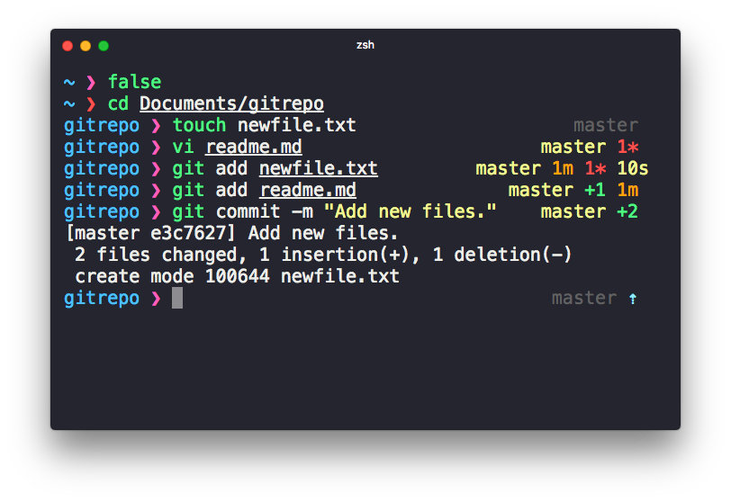

# Shaun

> Pretty, minimal and fast ZSH prompt




## Overview

Most prompts are cluttered, ugly and slow. At least it feels like that. I wanted something simple, easy and beautiful.

### Why?

- Comes with the perfect prompt character.
  Author went through the whole Unicode range to find it.
- Shows `git` branch and whether it's dirty (`*` for untracked files, `+` for staged files and `m` for modified files).
- Indicates when you have unpushed/unpulled `git` commits with up/down arrows.
- Prompt character turns red if the last command didn't exit with `0`.
- Command execution time will be displayed if it exceeds the set threshold.
- Username and host only displayed when in an SSH session.
- Makes an excellent starting point for your own custom prompt.


## Install

Can be installed manually. NPM repository is coming later. Requires git 2.0.0+ and ZSH 5.0.0+.

### Manually

1. Either…
  - Clone this repo
  - add it as a submodule, or
  - just download `shaun.zsh`

2. Symlink `shaun.zsh` to somewhere in [`$fpath`](http://www.refining-linux.org/archives/46/ZSH-Gem-12-Autoloading-functions/) with the name `prompt_shaun_setup`.

#### Example

```console
$ ln -s "$PWD/shaun.zsh" /usr/local/share/zsh/site-functions/prompt_shaun_setup
```
*Run `echo $fpath` to see possible locations.*

For a user-specific installation (which would not require escalated privileges), simply add a directory to `$fpath` for that user:

```sh
# .zshenv or .zshrc
fpath=( "$HOME/.zfunctions" $fpath )
```

Then install the theme there:

```console
$ ln -s "$PWD/shaun.zsh" "$HOME/.zfunctions/prompt_shaun_setup"
```


## Getting started

Initialize the prompt system (if not so already) and choose `shaun`:

```sh
# .zshrc
autoload -U promptinit; promptinit
prompt shaun
```


## Options

### `SHAUN_CMD_MAX_EXEC_TIME`

The max execution time of a process before its run time is shown when it exits. Defaults to `5` seconds.

### `SHAUN_GIT_DOWN_ARROW`

Defines the git down arrow symbol. The default value is `⇣`.

### `SHAUN_GIT_UP_ARROW`

Defines the git up arrow symbol. The default value is `⇡`.

## Example

```sh
# .zshrc

autoload -U promptinit; promptinit

# optionally define some options
SHAUN_CMD_MAX_EXEC_TIME=10

prompt shaun
```


## Tips

In the screenshot you see Shaun running in [HyperTerm](https://hyper.is) with the [hyperterm-snazzy](https://github.com/sindresorhus/hyperterm-snazzy) theme.
To have commands colorized as seen in the screenshot, install [zsh-syntax-highlighting](https://github.com/zsh-users/zsh-syntax-highlighting).


## Integration

### [oh-my-zsh](https://github.com/robbyrussell/oh-my-zsh)

1. Symlink (or copy) `shaun.zsh` to `~/.oh-my-zsh/custom/themes/shaun.zsh-theme`.
2. Set `ZSH_THEME="shaun"` in your `.zshrc` file.

### [antigen](https://github.com/zsh-users/antigen)

Update your `.zshrc` file with the following two lines (order matters). Do not use the `antigen theme` function.

```console
$ antigen bundle rqelibari/shaun
```

### [antibody](https://github.com/getantibody/antibody)

Update your `.zshrc` file with the following two lines (order matters):

```console
$ antibody bundle rqelibari/shaun
```
## Ports

* **Bash**
	* [sapegin/dotfiles](https://github.com/sapegin/dotfiles)’s [prompt](https://github.com/sapegin/dotfiles/blob/dd063f9c30de7d2234e8accdb5272a5cc0a3388b/includes/bash_prompt.bash) and [color theme](https://github.com/sapegin/dotfiles/tree/master/color) for `Terminal.app`.
* **Fish**
	* [brandonweiss/pure.fish](https://github.com/brandonweiss/pure.fish): a Pure-inspired prompt for Fish, not intended to have feature parity.
	* [rafaelrinaldi/pure](https://github.com/rafaelrinaldi/pure), support for bare Fish and various framework ([Oh-My-Fish](https://github.com//oh-my-fish/oh-my-fish), [Fisherman](https://github.com//fisherman/fisherman) and [Wahoo](https://github.com//bucaran/wahoo)).
* **Zsh**
  * [therealklanni/purity](https://github.com/therealklanni/purity): a more compact current working directory, important details on the main prompt line, and extra Git indicators.

## License

MIT © [Rezart Qelibari](https://github.com/rqelibari)
